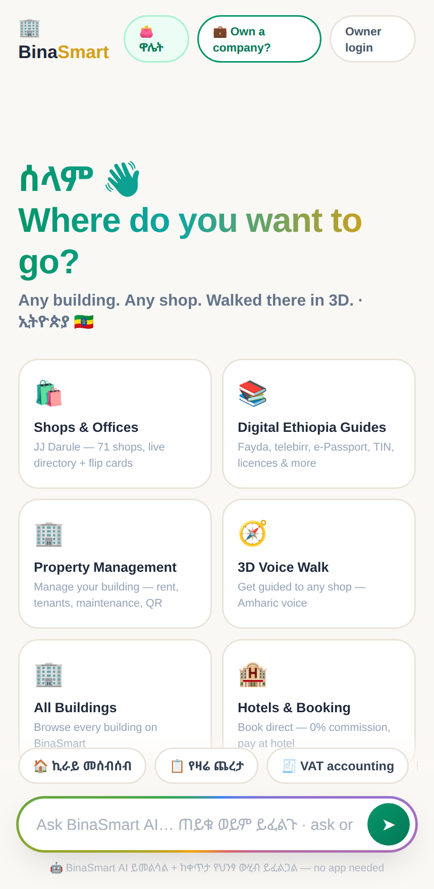

# BinaSmart

**Ethiopia's all-in-one digital platform** — [bina.et](https://bina.et)

BinaSmart brings smart building management, Digital Ethiopia service guides, free public tenders, hotel & travel booking, events, insurance, cars, property, payments and a bilingual (Amharic/English) AI assistant together in one place.

<p align="center">
  
</p>

---

## What's inside

### 🏢 Property & building management
QR code per unit, online rent collection via **telebirr** and **Chapa**, tenant screening, maintenance tracking, invoices, income reports, automatic VAT accounting (input/output VAT + VAT-return figures), sub-metering, and a private **owner dashboard** with its own AI agent. Owners sign in at `/owner`.

### 📚 Digital Ethiopia guides
Bilingual, step-by-step guides with structured schema (Article + HowTo + FAQ): Fayda, telebirr, CBE Birr, e-Passport, eVisa, TIN, business licence, VAT/TOT, customs & import duty, driving licence, car import, Yellow Card, bank account, birth/marriage certificate, utility bills — plus interactive tools (income-tax & customs-duty calculators).

### 📋 Free Ethiopian tenders
Government, bank and NGO tenders, updated daily, free to browse — with deadline reminders.

### 🛎️ More services
Hotel & travel booking, cinema & events ticketing, hospital directory, insurance comparison, car & property listings, a wallet, and online payments.

### 🤖 Bini — the 24/7 AI assistant
"Bini" (ቢኒ) is BinaSmart's bilingual assistant, available as a homepage search-box and a floating chat widget on every guide page.

- **Brain:** Google **Gemini 2.5 Flash-Lite** via the OpenAI-compatible endpoint, with a **local GLM model as automatic fallback** so Bini never goes dark.
- **Grounded & honest:** answers only from BinaSmart's real services; never invents prices, numbers or government portal names — it routes to the verified guide or WhatsApp instead.
- **Human & multi-turn:** empathy-first on problems, remembers the conversation, and offers conversation-starter chips.
- A separate **owner assistant** answers strictly from each building's own private data (occupancy, rent, VAT, maintenance).

---

## Tech stack

| Layer | Technology |
|-------|-----------|
| Runtime | Node.js |
| Web framework | [Fastify 5](https://fastify.dev) (`@fastify/static`, `@fastify/cors`) |
| Database | PostgreSQL via [Prisma 6](https://www.prisma.io) |
| Auth | [better-auth](https://www.better-auth.com) |
| Scheduling | `node-cron` |
| Frontend | Server-rendered static HTML (55 pages) + vanilla JS, bilingual (am/en) |
| AI | Gemini (OpenAI-compat) with local GLM fallback |
| Payments | Chapa, telebirr |

---

## Project structure

```
binasmart/
├── server.js              # Fastify app: all routes, APIs, Bini assistant, cron
├── prisma/
│   └── schema.prisma      # 50+ models (buildings, units, tenancies, invoices,
│                          #   tenders, hotels, events, wallet, payments, …)
├── public/                # 55 static HTML pages + assets + bina-assistant.js widget
├── seed-*.js              # per-building seed scripts
├── package.json
├── .env.example           # config template (copy to .env, fill in)
└── .gitignore
```

---

## Running locally

```bash
# 1. install dependencies
npm install

# 2. configure environment
cp .env.example .env        # then fill in the values

# 3. set up the database
npx prisma generate
npx prisma db push          # or: npx prisma migrate deploy

# 4. start
node server.js              # listens on 127.0.0.1:$PORT (default 4210)
```

### Configuration

Copy `.env.example` to `.env` and fill in the values. Keys:

| Variable | Purpose |
|----------|---------|
| `DATABASE_URL` | PostgreSQL connection string (Prisma) |
| `PORT` | HTTP port (default `4210`) |
| `BETTER_AUTH_SECRET`, `BETTER_AUTH_URL`, `AUTH_DISABLE_SIGNUP` | Authentication |
| `OWNER_KEY` | Global owner-dashboard access key |
| `BINI_API_FORMAT`, `BINI_API_BASE`, `BINI_API_MODEL`, `BINI_API_KEY` | Cloud LLM for Bini (OpenAI- or Anthropic-compatible) |
| `GLM_BASE`, `GLM_KEY`, `GLM_MODEL` | Local GLM fallback for Bini |
| `CHAPA_MODE`, `CHAPA_PUBLIC_TEST`, `CHAPA_SECRET_TEST` | Chapa payments |
| `BINA_FB_PAGE_ID`, `BINA_FB_PAGE_TOKEN` | Facebook page posting |
| `BINASMART_TG_TOKEN`, `BINA_TG_CHANNEL` | Telegram posting |

> **`.env` is never committed** — it holds secrets and is gitignored. Use `.env.example` as the template.

---

## Deployment

Production runs behind nginx, served by the Node process on `127.0.0.1:4210` and managed with **pm2** (`binasmart-api`). The app is edited in place and restarted with `pm2 restart binasmart-api`; this git repository is used for history and tracking, not as the deploy mechanism.

---

## License

Proprietary — © 2026 BinaSmart. All rights reserved. See [LICENSE](LICENSE).

The source is published for transparency and reference only; no permission is
granted to use, copy, modify, or redistribute it without written permission
from BinaSmart. For licensing inquiries: [bina.et](https://bina.et) · info@bina.et
